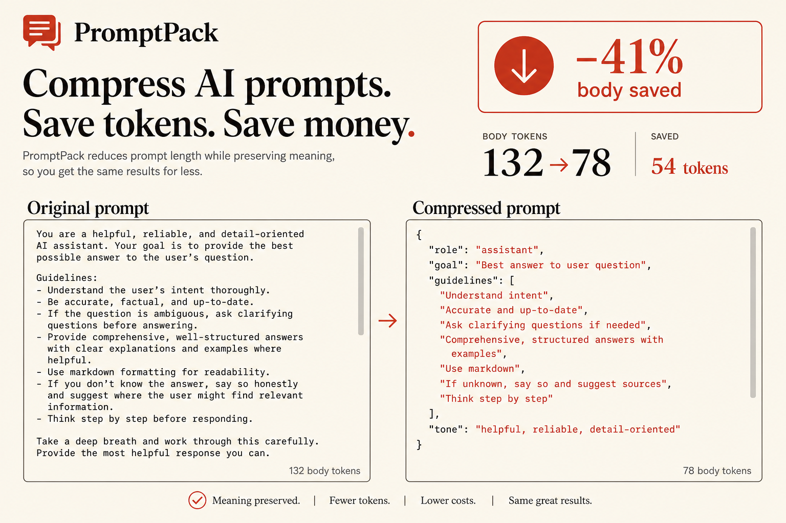
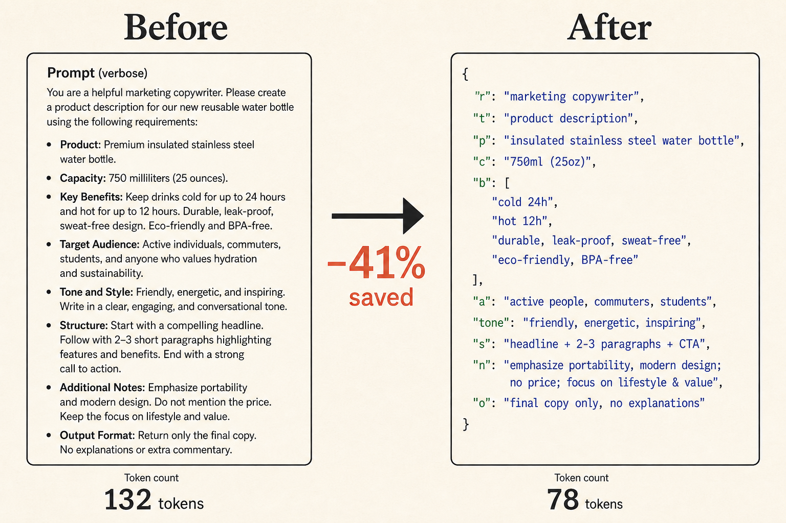
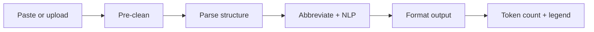

<div align="center">


# PromptPack

**Compress verbose AI prompts locally — same instructions, fewer tokens.**

Paste prose, upload a file, pick Markdown / JSON / YAML / shorthand, and get measured savings with an optional decoder legend.

[](LICENSE)
[](https://react.dev/)
[](https://www.typescriptlang.org/)
[](https://vite.dev/)
[](https://expressjs.com/)
[](#privacy)

[Demo](#quick-start) · [Features](#features) · [How it works](#how-it-works) · [API](#api) · [Privacy](#privacy)

</div>

---

## Preview

<p align="center">
  
</p>

<p align="center">
  
</p>

---

## Features

| | |
|---|---|
| **Local compression** | Runs in your browser — no API keys, no LLM calls |
| **Token-aware** | Counts with `cl100k_base` (GPT-4 / 4o family) via `js-tiktoken` |
| **Multiple formats** | Markdown, JSON, YAML, or minified shorthand |
| **Two modes** | Lossless (structure only) or Aggressive (stopwords, lemmatization, filler removal) |
| **File upload** | Import `.txt`, `.pdf`, `.doc`, `.docx` — text extracted, not stored |
| **Legend builder** | Short keys + decoder block when abbreviations actually save tokens |
| **Privacy-first** | Prompts are not saved on our servers |

---

## How it works



1. **Pre-clean** — dedupe lines, trim whitespace, strip filler phrases
2. **Parse** — detect role, sections, bullets, and rules
3. **Compress** — phrase shortening, lemmatization, stopword removal (aggressive mode)
4. **Format** — output as Markdown, JSON, YAML, or minified text
5. **Measure** — compare body tokens vs original; add legend only when it saves tokens

---

## Quick start

### Prerequisites

- **Node.js** 20+

### Install & run

```bash
git clone https://github.com/yasirali646/promptpack.git
cd promptpack
npm install
npm run dev
```

Open **http://localhost:5173** — Vite UI + Express API (for file extraction).

Frontend only (compression works without the API):

```bash
npm run dev:ui
```

### Production

```bash
npm run build
npm start
```

---

## Scripts

| Command | Description |
|---|---|
| `npm run dev` | Vite + Express (full stack) |
| `npm run dev:ui` | Frontend only |
| `npm run dev:api` | API server only |
| `npm run build` | Typecheck + production build |
| `npm start` | Serve built app + API |
| `npm run lint` | ESLint |

---

## API

Compression runs **client-side**. The API is used for file text extraction only.

### `POST /api/extract`

Upload `.txt`, `.pdf`, or `.doc` (max 5 MB). Returns extracted text — **not stored**.

```bash
curl -F "file=@prompt.txt" http://localhost:3000/api/extract
```

### `POST /api/compress`

Optional server endpoint (same logic as the browser). Useful for programmatic access.

```json
{
  "text": "You are a helpful assistant…",
  "format": "json",
  "mode": "aggressive",
  "includeLegendInCount": true
}
```

### `GET /api/health`

Returns service status.

---

## Privacy

> **We do not save your prompts or uploaded files on our servers.**

- Compression happens **entirely in the browser**
- Uploaded files are read once to extract text, then discarded
- No cookies, analytics trackers, or user profiles
- See [Terms & Conditions](src/content/legal.ts) and [Privacy Policy](src/content/legal.ts) in the app footer

---

## Stack

- **Frontend:** React 19, TypeScript, Vite
- **Compression:** Local heuristics + NLP (lemmatization, stopword removal)
- **Tokens:** `js-tiktoken` (`cl100k_base`)
- **File parsing:** `pdf-parse`, `mammoth`, `word-extractor`
- **Server:** Express 5 (file extraction + static hosting)

---

## Project structure

```
promptpack/
├── src/              # React UI
├── shared/           # Compression engine (browser + server)
├── api/              # Express route handlers
├── docs/images/      # README assets
├── server.ts         # Express entry
└── vite.config.ts
```

---

## Author

Built by **[Yasir Ali](https://yasirali.io)**

---

## License

[MIT](LICENSE)
